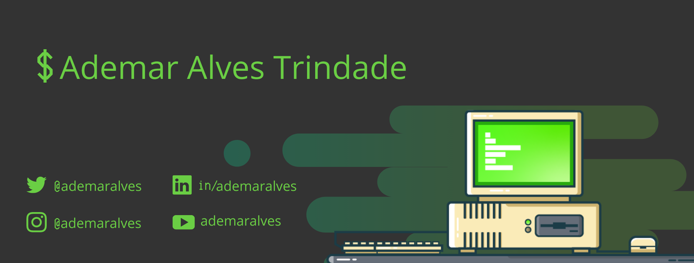

### Hi there 👋

<!--
**ademar-alves/ademar-alves** is a ✨ _special_ ✨ repository because its `README.md` (this file) appears on your GitHub profile.

Here are some ideas to get you started:

- 🔭 I’m currently working on ...
- 🌱 I’m currently learning ...
- 👯 I’m looking to collaborate on ...
- 🤔 I’m looking for help with ...
- 💬 Ask me about ...
- 📫 How to reach me: ...
- 😄 Pronouns: ...
- ⚡ Fun fact: ...
-->

  <table>
    <tr>
        <td></td>
        <td></td>
    </tr>
  </table>

### Hi! Welcome 👨‍💻

💻 I'm Software engineer with comprehensive knowledge of platform development, agile methodologies, and web-based applications. Dedicated to building high quality and innovative systems in an agile way. Involved with software communities and knowledge exchange.

🖖 Proud member of [Python MG](https://github.com/pythonmg) and [GoBH](https://github.com/gobelohorizonte).

✍️ Sometimes I write on my [blog](http://cassiobotaro.dev).
